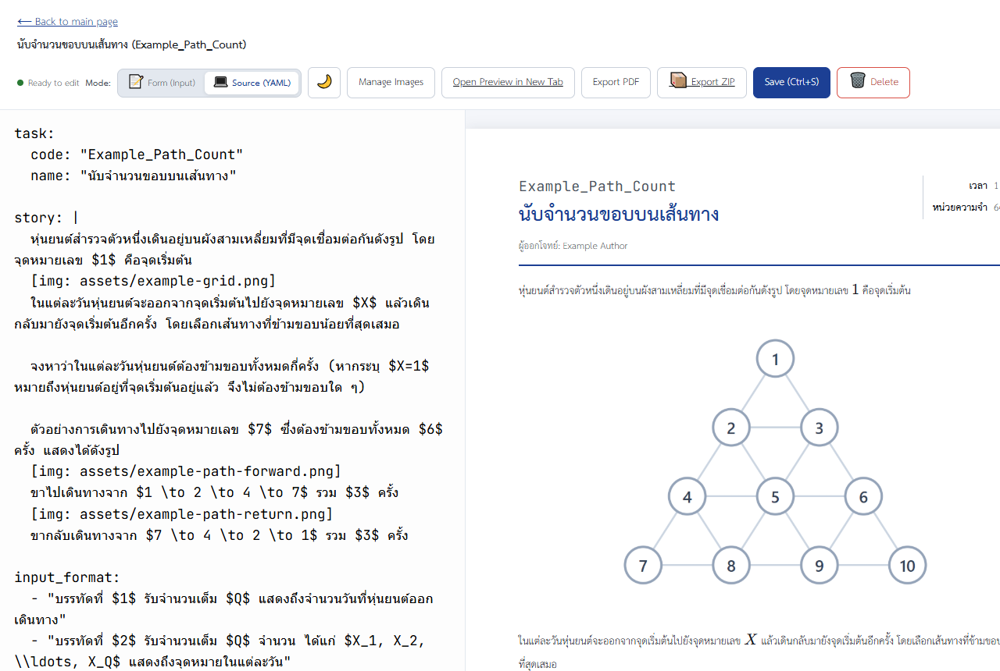
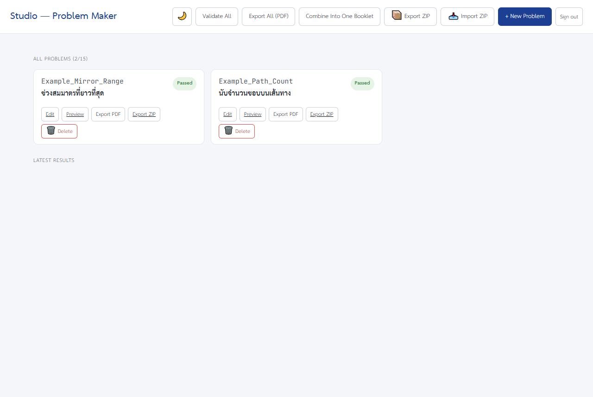
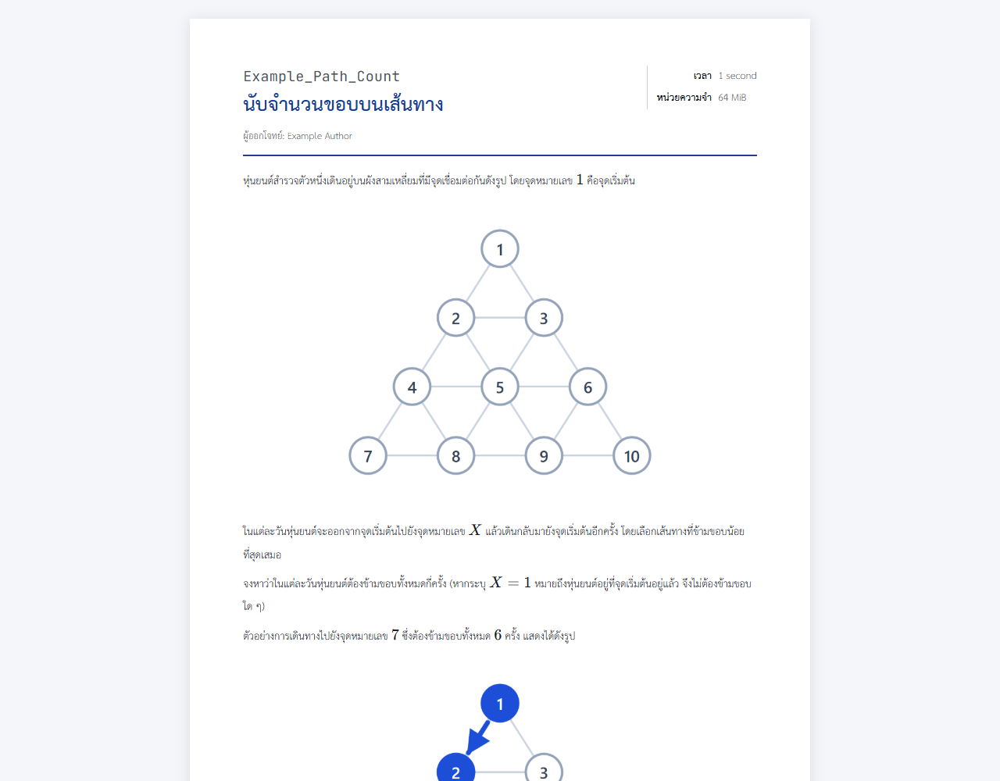

# Problem Studio (สอวน. / Task Maker)

[](https://github.com/MiyaZaki1072/RYWCC-Task-Maker/actions/workflows/ci.yml)
[](LICENSE)

Write competitive-programming problems in YAML, see them rendered live in the browser, and export
print-ready PDFs and booklets.

Built for Thai olympiad (สอวน.) problem sets, so Thai typography, KaTeX maths and A4 print layout
are handled properly rather than bolted on. The whole thing self-hosts as two Docker containers.



- **YAML in, PDF out.** One `problem.yaml` per problem; the preview and the PDF use the same
  template, so what you see is what prints.
- **Live editor.** Edit, preview and validate in one dashboard — no build step, no page reloads.
- **Maths and images.** KaTeX for formulas, per-problem `assets/` for diagrams.
- **Booklets.** Combine every problem into one document with a cover page and table of contents.
- **ZIP import/export.** Move problem sets between installations.
- **Offline fonts.** TH Sarabun New and JetBrains Mono ship with the repo; no CDN, no network at
  render time.

> **Note on content:** this repository contains the *tool*, not problems. `problems/` ships empty.
> The MIT licence below covers the code; anything you write with it is yours.

---

## Quick start (Docker)

The supported way to run this. Two containers: the studio, and its own Postgres.

```sh
git clone https://github.com/MiyaZaki1072/RYWCC-Task-Maker.git problem-studio
cd problem-studio

cp .env.example .env     # set STUDIO_PASSWORD and POSTGRES_PASSWORD
docker compose up -d --build
```

Open `http://localhost:4322` and sign in with the password you set.



The first build takes a few minutes — it installs Chromium and Thai fonts into the image. After
that, startup is seconds.

Full deployment guide, including ZimaOS, Cloudflare tunnels, backups and troubleshooting:
**[docs/ZIMAOS-DEPLOY.md](docs/ZIMAOS-DEPLOY.md)**.

### Configuration

Set in `.env`, read by `docker-compose.yml`.

| Variable | Default | Purpose |
|---|---|---|
| `STUDIO_PASSWORD` | *(required)* | The password on the sign-in page |
| `POSTGRES_PASSWORD` | *(required)* | Database password. Use hex — `openssl rand -hex 24` — because it is embedded in a connection URL |
| `PUBLIC_ORIGIN` | *(unset)* | Your public URL, e.g. `https://studio.example.org`. Used to reject cross-site form posts |
| `STUDIO_BIND` | `0.0.0.0` | Host interface to publish the port on. `127.0.0.1` keeps it off the LAN |
| `STUDIO_PORT` | `4322` | Host port |
| `SECURE_COOKIES` | `1` | Set `0` only when serving over plain HTTP |
| `TRUST_PROXY` | `1` | Proxy hops in front of the app |
| `SESSION_SECRET` | *(auto)* | Generated on first boot and stored in Postgres. Set it only to force every session to expire |
| `SESSION_TTL_HOURS` | `720` | How long a sign-in lasts |

---

## Local development

For writing problems on your own machine, without Docker:

```sh
npm install
npm run studio
```

That opens the dashboard on `http://127.0.0.1:4322`. It binds loopback only and runs without a
password — it is a single-user tool on your own machine, and the problems live in `problems/` as
ordinary files you can edit in any editor.

**Requirements:** Node.js 18 or newer. PDF export downloads Chromium on first use via Puppeteer.

If you point it at a network interface or set `NODE_ENV=production`, it requires `STUDIO_PASSWORD`
and refuses to start without one.

---

## Security

The studio is designed to be reachable from the internet, so the authentication is deliberate
rather than incidental:

- **One shared password**, not user accounts. Sign-in is a real page; the browser holds a signed,
  expiring session cookie rather than the password itself.
- Cookies are `HttpOnly`, `SameSite=Strict`, and `Secure` unless you turn that off for plain HTTP.
- The password is compared in **constant time**, so timing cannot be used to recover it.
- Sign-in attempts are rate limited to **10 per 15 minutes per IP**.
- State-changing requests are rejected when they originate from another site.
- Changing `STUDIO_PASSWORD` invalidates every existing session.
- The server **refuses to start** without a password or without a database, rather than quietly
  running open.

**What this is not:** there are no per-user accounts, no audit log, and no password reset. It is
built for a small group of trusted authors behind a password, not for untrusted public sign-ups.
If you need to know *who* changed a problem, this is not the right tool yet.

Found a security problem? Please open an issue — or, for anything sensitive, contact the
maintainer privately rather than filing publicly.

---

## Writing a problem

Each problem is a directory under `problems/`:

```text
problems/Example_Task/
├── problem.yaml     <- the problem definition
└── assets/          <- images referenced by it
```

Create one with `npm run new "Example Task"`, or the **+ New Problem** button in the dashboard.

### `problem.yaml` schema

| Field | Type | Description | Required |
|---|---|---|---|
| `task.code` | string | Short identifier, used in exported filenames | Yes |
| `task.name` | string | Problem title shown in the header | Yes |
| `logo` | string | Header logo path, e.g. `assets/logo.png`, or `global/logo.png` from the library | No |
| `story` | string | The problem statement | Yes |
| `input_format` | string[] | Lines describing the input | Yes |
| `output_format` | string[] | Lines describing the output | Yes |
| `constraints` | string[] | Bounds and limits | Yes |
| `subtasks` | object[] | Scoring partitions: `{ score: number, condition: string }` | No (`subtasks: []`) |
| `examples` | object[] | Test cases with `input`, `output`, optional `explanation` / `image` | Yes |
| `limits.time` | string | Time limit, e.g. `"1 second"` | Yes |
| `limits.memory` | string | Memory limit, e.g. `"256 MiB"` | Yes |
| `author` | string | Problem author | Yes |

### Syntax

- **Maths** — `$1 \le N \le 10^5$` inline, `$$...$$` centred. Escape a literal dollar as `\$`.
- **Images** — `[img: assets/diagram.png]`, or `[img: assets/diagram.png | Caption text]`.
- **Shared images** — `global/<name>` in any image slot (`logo: "global/logo.png"`,
  `[img: global/logo.png]`) uses an image from the library. See below.
- **Indentation** — spaces only. YAML rejects tabs.

### The library

**📚 Library** on the dashboard holds what every problem shares:

- **Images**, like the contest logo. Problems link to them live as `global/<name>`, so replacing
  `logo.png` on the library page updates every problem, preview and PDF at once. Typing `img` in
  the editor, or its image picker's **Global library** tab, fills this in. Each library card shows
  how many problems use the image, and deleting one first lists them. A name that is only wrong
  in uppercase/lowercase gets a "did you mean global/logo.png?" warning.
- **Text snippets**, like the contest rules. The editor's **📋 Snippets** button inserts one at the
  cursor in the field you were last typing in (or copies it). It is a copy: editing the snippet
  later does not change problems that already contain it.

**ZIP export and import.** A single problem's **📦 Export ZIP** copies each library image it uses
into its own `assets/` (as `global-<name>`), so the package is complete wherever it is imported.
The dashboard's **📦 Export ZIP** is the backup of the whole studio: it carries the library itself
in `_library/`, and its problems keep their live `global/` links. Importing it restores the library
too — **Add as new** keeps any image or snippet already here with the same name, **Overwrite**
replaces it.

That YAML renders to this — the same template the PDF export uses, so the preview is what prints:



---

## Commands

| Command | What it does |
|---|---|
| `npm run studio` | Open the dashboard (local development) |
| `npm run new "<Name>"` | Create a new problem from the template |
| `npm run preview problems/<dir>` | Auto-reloading preview of one problem |
| `npm run pdf problems/<dir>` | Export one problem to `dist/<code_name>.pdf` |
| `npm run pdf:all` | Export every problem individually |
| `npm run pdf:booklet` | Combine every problem into one booklet |
| `npm run validate` | Check every `problem.yaml` against the schema |
| `npm run serve` | Run the server the way the container does (needs `DATABASE_URL`, `STUDIO_PASSWORD`) |
| `npm run build:server` | Bundle the server to `build/server.js` |
| `npm run db:init` | Create the database tables |

### Tests

| Command | Covers |
|---|---|
| `npm run typecheck` | TypeScript, plus a syntax check of the browser scripts |
| `npm run verify:security` | Auth, sessions, CSRF, upload limits, rate limiting |
| `npm run verify:zip` | ZIP export and import, including collision handling |
| `npm run test:text` | Text and maths rendering regressions |
| `npm run test:assets` | Image handling (requires a database) |
| `npm run test:library` | The shared library: `global/` images, snippets, usage counts, ZIP flattening, library backup and restore. Its cross-instance checks run only with a database |

CI runs these on every push and pull request, plus a container build that asserts Chromium, the
Thai fonts and the runtime files are really in the image, and that the server refuses to start
without a password. `test:assets` is the exception — it needs a live database, so it is run
locally rather than in CI. `test:library` runs in CI without one; run it locally with
`DATABASE_URL` set (to a UTF-8 database) to cover the cross-instance part too.

---

## How it works

Postgres is the source of truth. Each running instance keeps a working copy of the problems on its
own filesystem so the rendering and PDF pipeline can read ordinary files, and reconciles that copy
against the database on boot and in the background. In the container that working copy is scratch
space — deliberately not a volume — so a restart always rebuilds it from the database.

Images are stored in the database as base64 text alongside the problem they belong to. Library
images are stored the same way with a content hash. Each instance's cached copy is named by that
hash, and every request checks the current hash first, so a logo replaced or deleted on one
instance is never served stale by another.

### Layout

| Path | Contents |
|---|---|
| `src/render.ts` | YAML → validated model → HTML. Shared by preview and PDF |
| `src/studio-server.ts` | The dashboard's HTTP routes |
| `src/auth.ts` | Sign-in, sessions, cross-site checks |
| `src/storage-db.ts` | Postgres storage and working-copy reconciliation |
| `src/library.ts` | The shared library: `global/` images and text snippets |
| `src/db.ts` | Connection pool and query helpers |
| `src/pdf-export.ts` | Chromium-driven PDF rendering |
| `src/booklet.ts` | Cover page and table of contents |
| `src/studio-public/` | Browser-side CSS and JavaScript |
| `config/schema.ts` | Zod schema for `problem.yaml` |
| `templates/render.hbs` | Problem layout template |
| `assets/style.css` | Print styles, page breaks, typography |
| `assets/fonts/` | TH Sarabun New, JetBrains Mono |

---

## Licence

MIT — see [LICENSE](LICENSE).

The licence covers this code. Problems you write with it are yours, and any problem content you add
to `problems/` is governed by whatever terms you choose for it.
